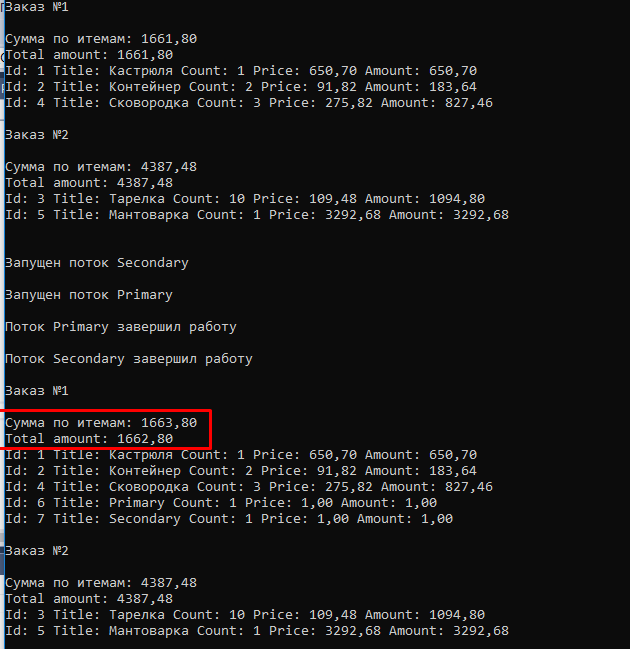

a. Написать консольное приложение с потоками, сделать так чтобы в результате обновления одного и того же Order его Amount был 
не равен его Items.Sum(x => x. Amount)

b.Предложить, как минимум два способа устранения проблемы средствами БД, один из которых – изоляция транзакции
(выбрать минимально необходимый уровень изоляции), другой - неблокирующий запись таблицы БД.

1 способ: минимальный уровень изоляции транзакции для решения проблемы - Repeatable Read, т.к. на уровнях ниже блокировка удерживается только на время работы с ресурсом, а в данном случае нужно, чтобы блокировка удерживалась на протяжении всей транзакции. Т.о. при уровне изоляции Repeatable Read одна из двух транзакций не сможет модифицировать ресурс(в данном случае изменение Amount при вставке новой строки) во время работы другой транзакции выполняющей также чтение и вставку строки. Вторая транзакция будет ожидать полного завершения первой транзакции.

2 способ: основан на версионности данных. СУБД создает новую версию строки для транзакции при каждом изменении данных в этой строке. 
С этой новой версией продолжает работать та транзакция, которая ее создала, но любая другая транзакция видит строку в том виде, 
в котором она была зафиксирована, т.е. в том виде, пока не началась транзакция, изменяющая эту строку. 

Реализовать в приложении не удалось, 80% времени выполнения тестового задания ушло на этот пункт, поэтому в приложении 
реализация только неработающего варианта с применением изоляции транзакций.
