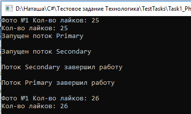

c.	Написать консольное приложение с потоками, сделать так чтобы в результате обновления одного и того же Photo, 
количество лайков Likes не соответствовало количеству реально сделанных лайков.

d.	Предложить способ устранения проблемы через изоляцию транзакций (выбрать минимально необходимый уровень изоляции)
Минимальный уровень изоляции транзакции - **READ COMMITTED**. Данный уровень препятствуют чтению незафиксированных данных
(в данном случае число лайков до обновления).

**В консольном приложении была попытка также использовать транзакцию, через раз программа при уровне изоляции READ COMMITTED выдавала правильные результаты.**
