2.	Web API - Реализовать RESTful сервис для Order и OrderItem

Главная страница приложения после запуска содержит общий список заказов:
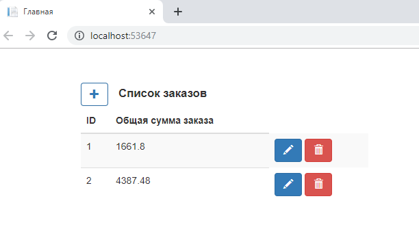

Редактирование заказа:
При нажатии на кнопку "Редактировать" в строке заказа ниже отображается список всех позиций выбранного заказа. 
Под таблицей отображается общая сумма заказа.
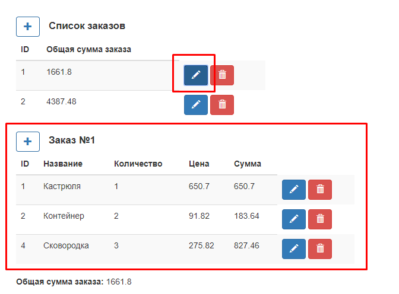

Добавление новой позиции в заказ:
При нажатии на кнопку "Добавить" становится видимой форма добавления новой позиции заказа.
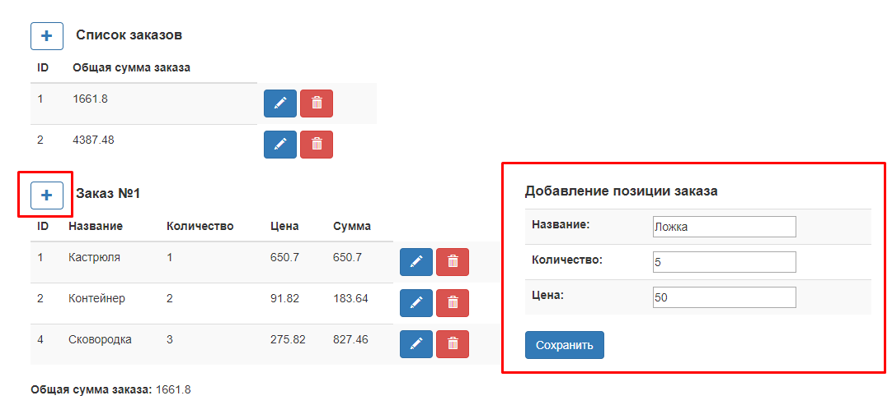

После нажатия на кнопку "Сохранить", позиция добавится в список позиций, а также пересчитается общая сумма заказа в таблице заказов и
под списком позиций заказа в поле "Общая сумма заказа".
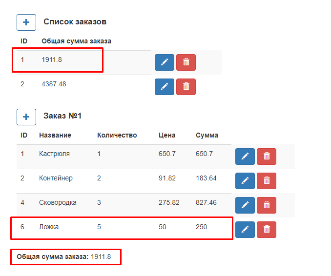

Редактирование позиции заказа:
При нажатии на кнопку "Редактировать" в строке позиции заказа становится видимой форма редактирования выбранной позиции заказа
с отображением теущих значений полей позиции.
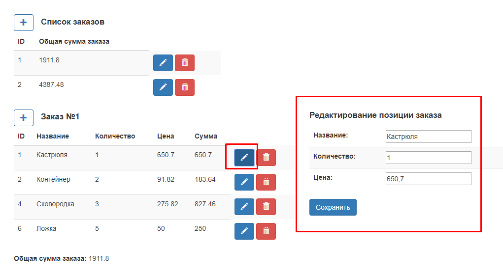

Внесение изменений в поле "Количество"(пример):
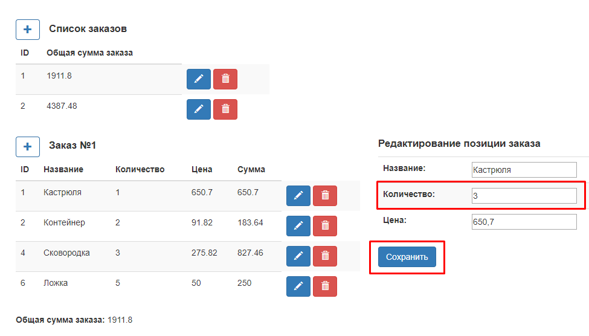
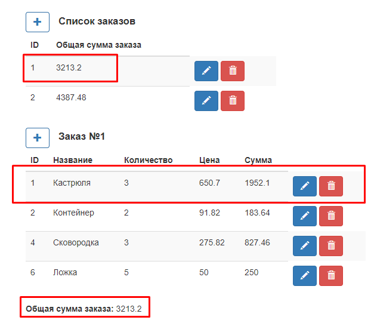

Удаление позиции заказа осуществляется нажатием кнопки "Удалить" в строке позиции. После удаления также пересчитывается общая сумма заказа:
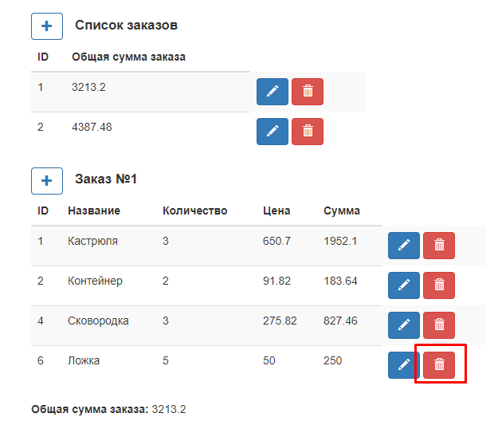
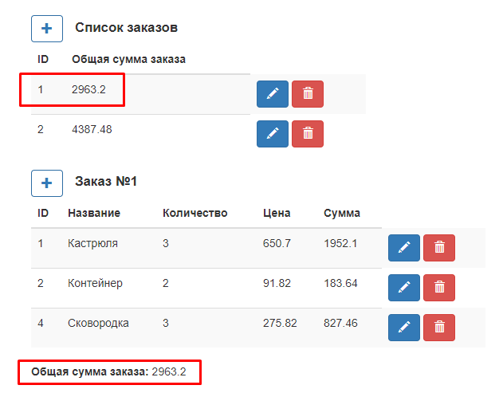

Валидация данных(при добавлении и редактировании позиции заказа):
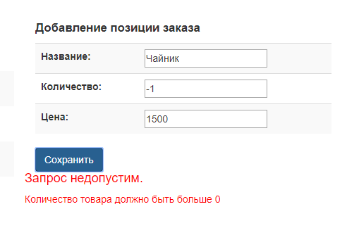

Добавление нового пустого заказа осуществляется нажатием на кнопку "Добавить" над таблицей заказов:
!Добавление нового заказа](Assets/Добавление нового заказа.png)

После нажатия ниже в списке заказов появится новая строка с общей суммой заказа равной 0:
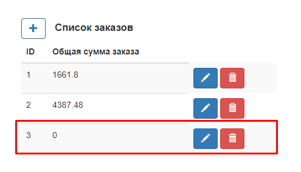

При нажатии на кнопку "Редактировать" в строке заказа ниже отобразится пустая таблица позиций заказа:
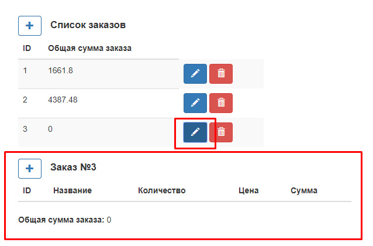

Далее заказ заполняется новыми позициями путем добавления через кнопку "Добавить" аналогичным образом.
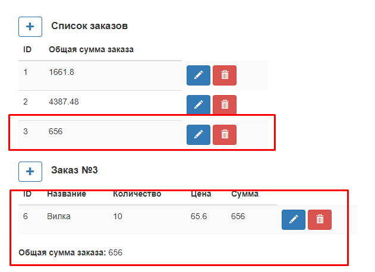

Удаление заказа вместе с позициями осуществляется нажатием кнопки "Удалить" в строке заказа.
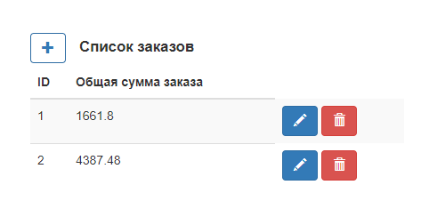
